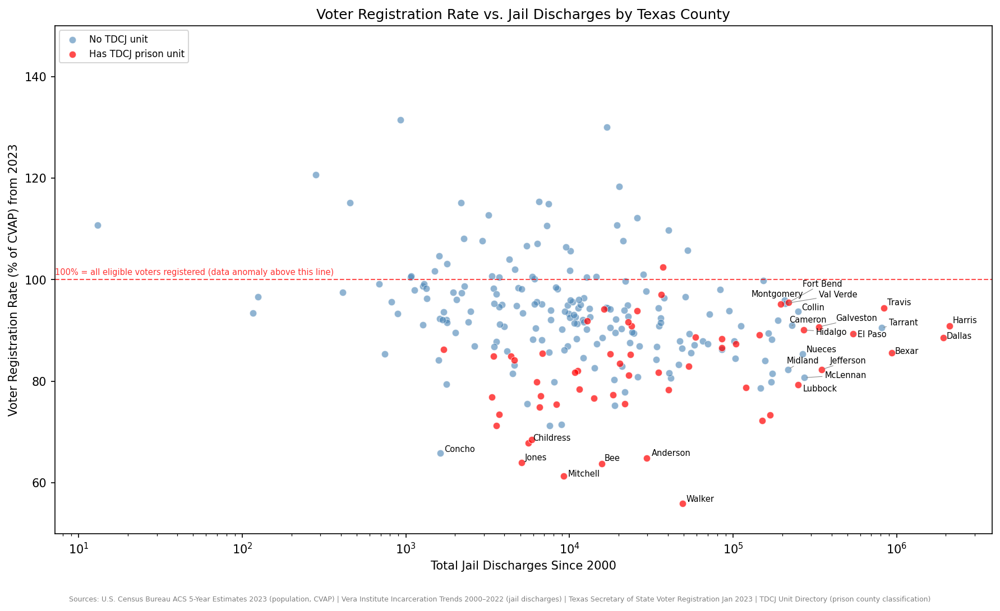

# Texas Incarceration & Voter Registration Gap

Analyzes the relationship between incarceration history and voter registration rates across all 254 Texas counties. Produces a scatter plot of jail discharge totals vs. 2023 voter registration rates, segmented by whether a county hosts a TDCJ state prison unit.



## Research Question

Do Texas counties with higher cumulative jail discharge counts show lower voter registration rates among citizens of voting age? And do counties that host TDCJ state prison units behave differently — possibly because incarcerated people inflate jail population counts without being eligible to vote?

## Data Sources

| Source | What it provides | Vintage |
|---|---|---|
| [U.S. Census Bureau ACS 5-Year Estimates](https://api.census.gov/data/2023/acs/acs5) | County population (`B01001_001E`) and citizen voting-age population (`B29001_001E`) | 2023 |
| [Vera Institute Incarceration Trends](https://github.com/vera-institute/incarceration-trends) | Annual jail discharges and prison population by county | 2000–2022 |
| [Texas Secretary of State — Historical Voter Registration](https://www.sos.state.tx.us/elections/historical/jan2023.shtml) | Registered voters by county | January 2023 |
| [TDCJ Unit Directory](https://www.tdcj.texas.gov/unit_directory/) | Names and counties of all active Texas prison units | Live (scraped at runtime) |

Census 2023 vintage is used to align with the January 2023 SOS voter registration snapshot. Vera data is capped at 2022, its most recent complete year.

## How It Works

1. **TDCJ prison county extraction** — Fetches the live TDCJ unit directory HTML and passes it to Claude (`claude-opus-4-7`) to extract unit names and counties. Avoids maintaining a hardcoded list that would go stale as units open or close.
2. **Census API** — Fetches total population and CVAP (Citizen Voting-Age Population) for all Texas counties via two separate API calls.
3. **Vera Institute CSV** — Downloads and filters to Texas rows, capped at 2022.
4. **Texas SOS HTML scraping** — Scrapes the January 2023 voter registration table with `pandas.read_html`.
5. **SQLite database** — Loads all data into a local `.db` file with four tables: `counties`, `releases`, `supervision_current`, `voter_registration`.
6. **SQL analysis** — CTE-based queries compute cumulative jail discharges and registration rates per county.
7. **Scatter plot** — Layered seaborn plot with log x-axis, overlapping-label correction via `adjustText`, and three visual layers: no TDCJ unit (blue), has TDCJ unit (red), >50% missing discharge data (black ×).

## Setup

### Requirements

```
pip install requests pandas matplotlib seaborn anthropic adjustText lxml
```

### Environment Variables

```bash
export CENSUS_API_KEY="your_key_here"      # https://api.census.gov/data/key_signup.html
export ANTHROPIC_API_KEY="your_key_here"   # https://console.anthropic.com
```

Add both to `~/.zshrc` (or `~/.bashrc`) so they persist across sessions.

### Run

```bash
python tx-civic-eligibility.py
```

Output: `~/tx-voter-eligibility.db` (SQLite) and `~/tx-voter-scatter.png` (chart).

## How to Read the Chart

- **X-axis (log scale)**: Total jail discharges per county since 2000. Log scale compresses Harris County's ~2M discharges into the same view as rural counties with ~500.
- **Y-axis**: Voter registration rate as a percentage of CVAP. 100% means every eligible citizen is registered.
- **Red dashed line at 100%**: Points above this line are data anomalies — Census CVAP undercounts in fast-growing suburban counties (Collin, Fort Bend) and tiny rural counties (Kenedy at 610%, Loving at 217%) cause registration rates to exceed 100%.
- **Y-axis capped at 50–150%**: Extreme outliers above 150% are excluded to keep the main distribution readable.
- **Red dots**: Counties hosting at least one TDCJ state prison unit. These tend to have elevated jail discharge totals because state prisoners are counted in the data.
- **Black × markers**: Counties where more than 50% of annual jail discharge records from Vera are NULL — discharge totals for these counties are unreliable.

## Known Limitations

- **29.9% overall NULL discharge rate** in Vera data, concentrated in small rural counties in early years (pre-2005). This is a known gap in the Vera dataset, not a pipeline error.
- **CVAP > 100% anomaly** in fast-growing suburbs and very small counties. Census CVAP estimates lag actual population growth and have high margins of error for low-population counties. The y-axis cap mitigates this visually.
- **County name normalization**: SOS uses `LASALLE` while Census uses `La Salle`. Spaces are stripped from both sides before matching to avoid silent misjoins.
- **Prison vs. jail distinction**: Vera's `total_jail_discharges` reflects county jails, not state prisons. Counties with TDCJ units (red dots) may have elevated counts if state transfers pass through the local jail. The red-dot layer flags these for visual interpretation.
- **Voter eligibility vs. registration**: This analysis measures registration rates among citizens of voting age, not among those legally eligible to vote. Texans on felony supervision (parole/probation) are ineligible to register — this population is not subtracted from CVAP, so registration rates in high-supervision counties are understated relative to true eligible-voter registration rates.
